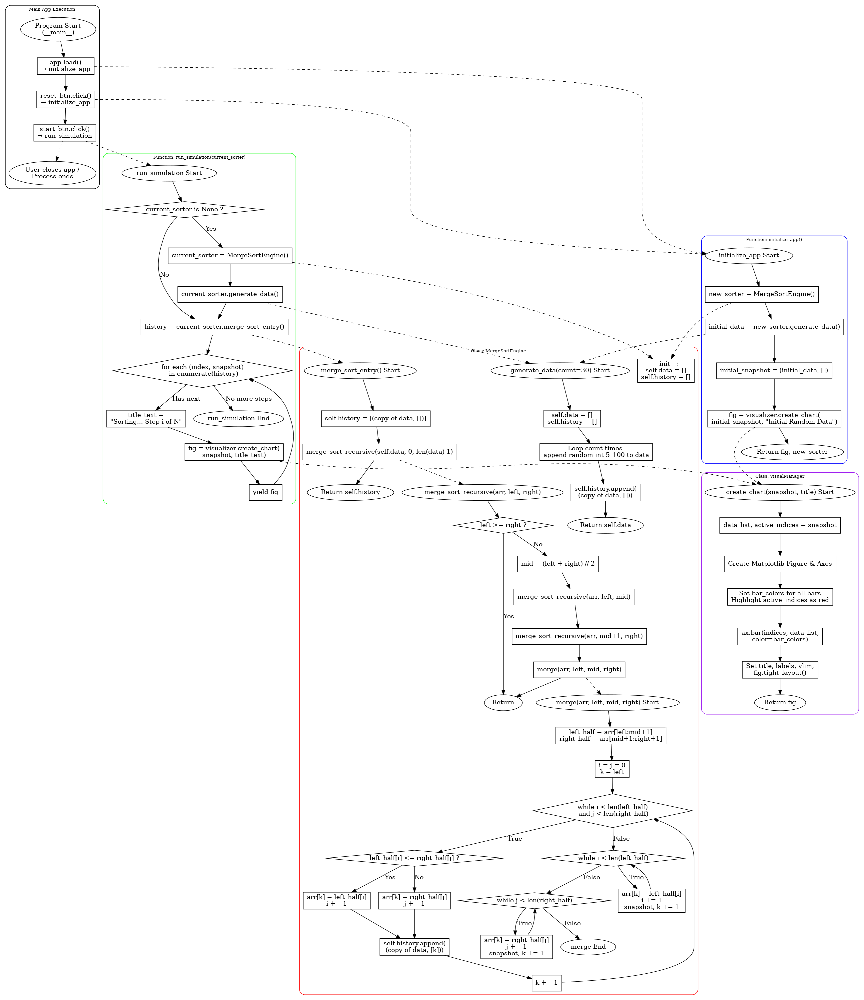

# 📉 Merge Sort Visualizer
## Demo video/gif/screenshot of test

Version 1: Initial Prototype
Implemented the core Merge Sort Algorithmand basic matplotlib plotting.
Issue: A severe memory leak was discovered during testing, causing the web app's RAM usage to spike after multiple runs.

Version 2: Architecture Refactoring
Faced with the system-level problem of memory leaks, which was beyond my current knowledge, I sought specialized guidance from Gemini 3.0.
Prompt used: "As a first-year university CS student, and you, as a university CS instructor, guide me on how to handle the memory leak issue in the web application above."

Version 3: Visual UX Enhancement
The Data Structure has been optimized, and "Active Indices" metadata has been added when recording sorting history. Conditional rendering has been implemented in the Visualization Layer: array elements undergoing Compare and Merge operations are rendered in high-contrast red, significantly improving the readability of algorithm demonstrations.

---
## Problem Breakdown & Computational Thinking
Rationale for Choosing Merge Sort

I chose Merge Sort for its guaranteed time complexity of $O(N \log N)$, which ensures performance stability unlike Quick Sort. Although it requires $O(N)$ space, this space-time trade-off is optimal for modern hardware where memory is not small.

  #### **①Problem Decomposition**

  * Break the problem into sub-parts:  
    1. **Random Data Generation**: Implement a function to generate a randomized list of 30 integers to serve as the initial dataset.  
    2. **Recursive Divide**: Create a recursive function that continuously divides the list into halves until atomic sub-lists are reached.  
    3. **Conquer**: Implement the logic to merge two sorted sub-lists back into a single sorted list by comparing elements sequentially.  
    4. **Visualization**: Integrate a mechanism to record the state of the list after every data modification during the merge process to enable frame-by-frame animation.

  #### **②Pattern Recognition**

  * Similarities to known problems:  
    * **Divide and Conquer Strategy**
    * **Recursive Tree Traversal**
  #### **③Abstraction**

  * Ignore unnecessary details, focus on:  
    * **Inputs needed**: The list size (fixed at 30 for visualization) and value range. We ignore user-defined array sizes for simplicity in the UI.  
    * **Outputs required**: An ordered sequence of list states rather than just the final sorted list.  
    * **Core relationships**: The essential comparison logic: if Left\[i\] \<= Right\[j\], append Left\[i\] to the result; otherwise, append Right\[j\].

  #### **④Algorithmic Thinking**

  * **Inputs**: An unsorted list A containing N integers (where N=30).  
  * **Outputs**: A series of lists \[A\_0, A\_1, ..., A\_k\] representing the state of the array at each step k of the sorting process, concluding with the fully sorted list.  
  * **Constraints**:  
    * List size limited to 30 elements to ensure the bar chart remains readable in the GUI.  
    * Value range 5-100 to fit strictly within the y-axis chart limits.  
    * The visualization must reflect the O(N log N) complexity logic, showing the "grouping" effect of merge sort.
  
  #### **⑤Flowchart**

---

## **Steps to Run & User Guide**
1. Access the App  
   Click the link below to open the App:  
   [**https://huggingface.co/spaces/19C/CISC121\_Final\_Project**](https://huggingface.co/spaces/19C/CISC121_Final_Project)
2. **How to Interact**  
   * **Start Visualization**: Click the orange **"Start Sorting"** button. The algorithm will begin, and you will see the bar chart animate.  
   * **Understand the Visuals**:  
     * 🟦 **Blue Bars**: Represent static or already sorted elements.  
     * 🟥 **Red Bars**: Highlight the elements currently being compared or moved by the Merge Sort algorithm.  
   * **Reset**: Click **"Generate New Data"** to create a fresh set of random numbers and reset the visualization.

## **Hugging Face Link**

[**https://huggingface.co/spaces/19C/CISC121\_Final\_Project**](https://huggingface.co/spaces/19C/CISC121_Final_Project)

## **Author & Acknowledgment**

**Author:** 
    * **Hengyi Dong**

**Acknowledgment**

* **Course**: CISC-121 (Introduction to Computing Science II)  
* **Instructor**: Dr. Rahatara Ferdousi  
* **Resources**:  
  * [Gradio](https://www.gradio.app/) for the web interface.  
  * [Matplotlib](https://matplotlib.org/) for generating real-time charts.  
  * Standard "Divide and Conquer" algorithm theory.